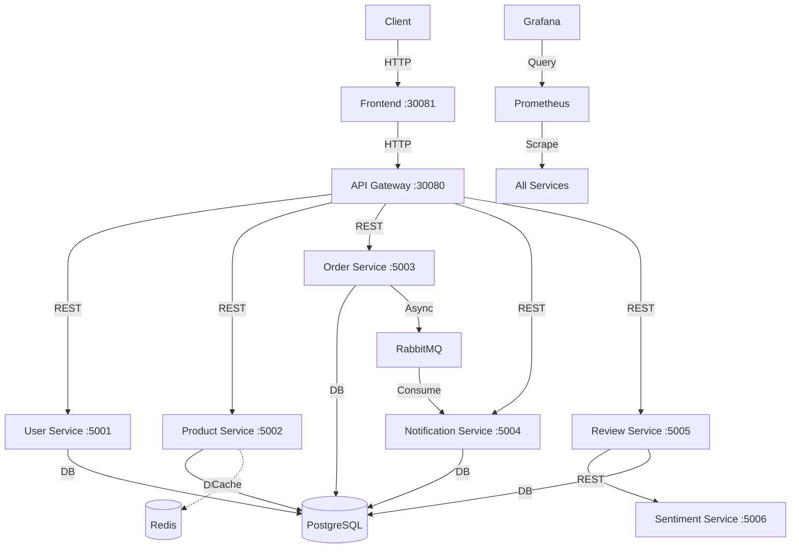

# Microservices E-commerce & Sentiment System

A production-ready microservices application built with Python Flask, featuring sentiment analysis, orchestrated with Docker Compose or Kubernetes, and monitored with Prometheus and Grafana.

## Architecture



## Services
| Service | Port (Int) | Port (K8s NodePort) | Description |
|---------|------------|---------------------|-------------|
| **Frontend** | 5005 | 30081 | Web UI for the application. |
| **API Gateway** | 5000 | 30080 | Entry point, routing, JWT auth, rate limiting. |
| **User Service** | 5001 | - | Manages users (Register/Login + JWT). |
| **Product Service** | 5002 | - | Manages products (Add/View + Redis Cache). |
| **Order Service** | 5003 | - | Manages orders, verifies products, RabbitMQ producer. |
| **Notification Service** | 5004 | - | Log notifications (RabbitMQ consumer). |
| **Review Service** | 5005 | - | Manages product reviews, calls Sentiment Service. |
| **Sentiment Service**| 5006 | - | NLP-based sentiment score provider (TextBlob). |

## Prerequisites
- Docker & Docker Compose
- Kubernetes (Minikube or Docker Desktop K8s)
- PowerShell (for deployment script)

## Deployment Options

### Option 1: Docker Compose (Rapid Dev)
1. Run the application:
   ```bash
   docker-compose up --build
   ```
2. Verify deployment:
   ```bash
   python verify_deployment.py
   ```

### Option 2: Kubernetes (Production-like)
1. Run the automated deployment script:
   ```powershell
   .\deploy-k8s.ps1
   ```
   *This script builds images, loads them into Minikube (if detected), applies manifests, and waits for pods.*

2. Access the system:
   - **Frontend**: [http://localhost:30081](http://localhost:30081)
   - **API Gateway**: [http://localhost:30080](http://localhost:30080)
   - **Prometheus**: [http://localhost:30090](http://localhost:30090)
   - **Grafana**: [http://localhost:30030](http://localhost:30030) (admin / admin)

## Monitoring
- **Prometheus**: Data collection from all microservices.
- **Grafana**: Pre-configured dashboards for system health.

## CI/CD
A GitHub Actions workflow (`.github/workflows/ci.yml`) validates the configuration and builds images on every push to `main`.
